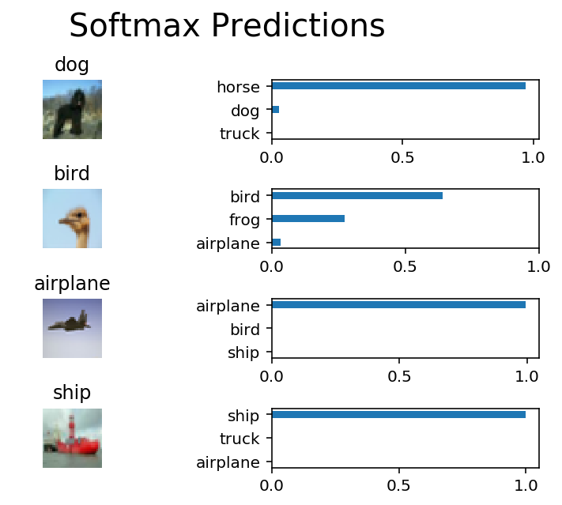

# CNN images classification

---

+ Built a **Convolutional Neural Network (CNN)** by using *TensorFlow* and classified images from the *CIFAR-10* dataset
+ Implemented `normalizing` on images, and `one-hot encoding` on labels
+ Applied `convolutional` layers to reduce the feature map size and increase the depth
+ Followed by `max pooling` to reduce output size and prevent overfitting
+ Applied `dropout` layer for `regularization`
+ Implemented `flatten` layer to change the tensor dimension
+ Added two `fully-connected` layers at top of the CNN model, and connected a classifier at end to get output
+ Got over 75% accuracy on test data

